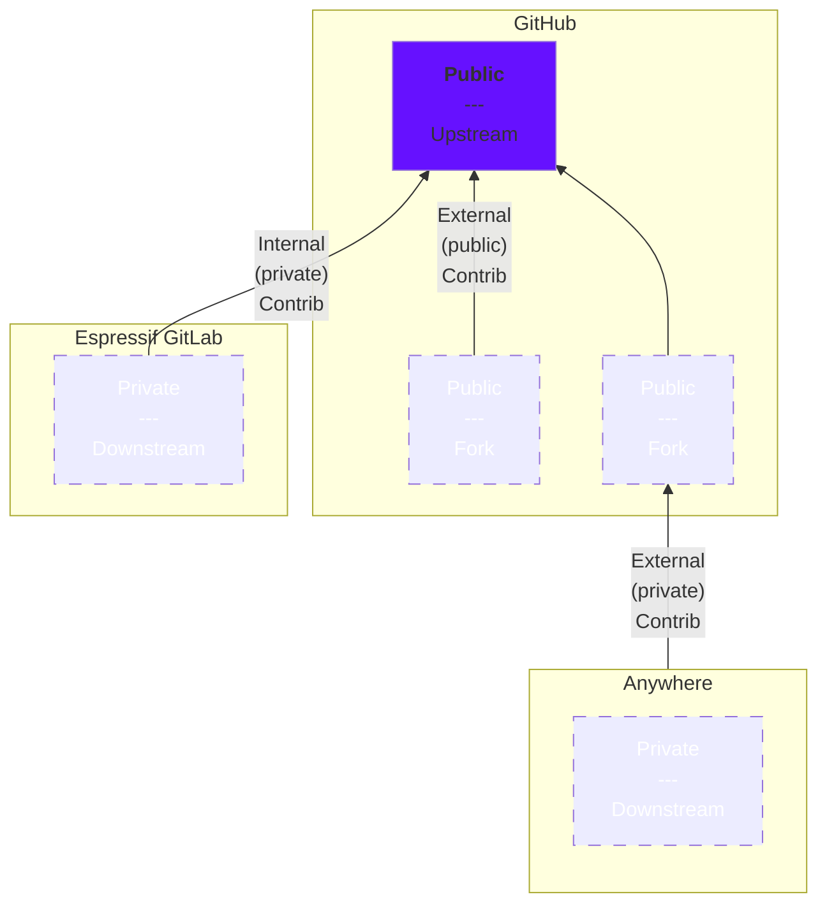

# website

This is my website.

```mermaid
flowchart BT
    id1["`**Public**
    ---
    Upstream`"]
    id2["`Private
    ---
    Downstream`"]
    id3["`Public
    ---
    Fork`"]
    id4["`Private
    ---
    Downstream`"]
    id5["`Public
    ---
    Fork`"]
    subgraph GitHub
        direction BT
        id1
        id3
        id5
    end
    subgraph Espressif GitLab
        id2
    end
    subgraph Anywhere
        id4
    end
    id2 -- Internal \n(private) \nContrib --> id1
    id3 -- External \n(public) \nContrib --> id1
    Anywhere -- External \n(private) \nContrib --> id5
    id5 --> id1
    style id1 fill:#61f
    classDef dashedStyle stroke-width:1px,color:#fff,stroke-dasharray: 10 10;
    class id2,id3,id4,id5 dashedStyle;
```
